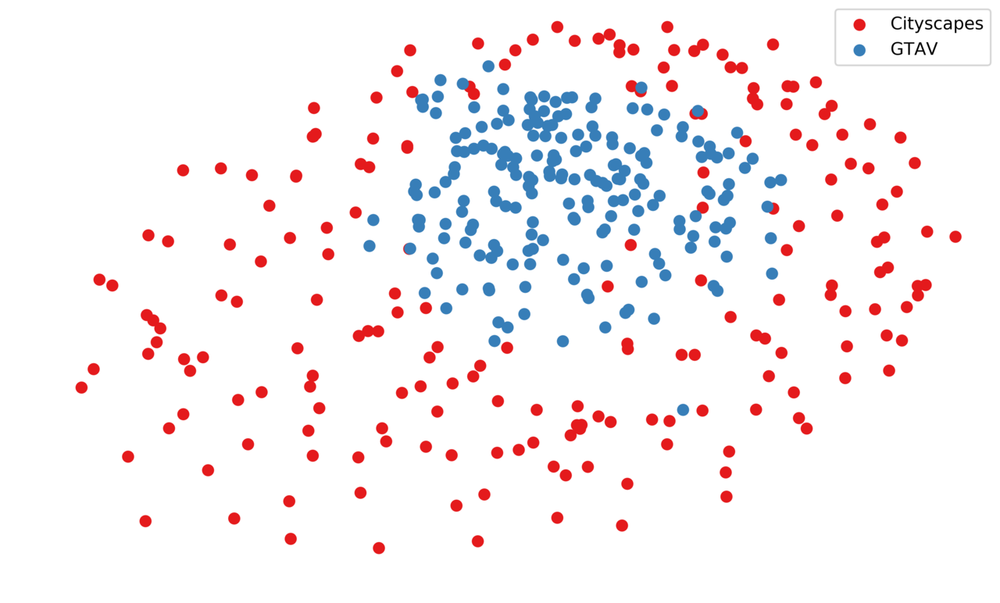
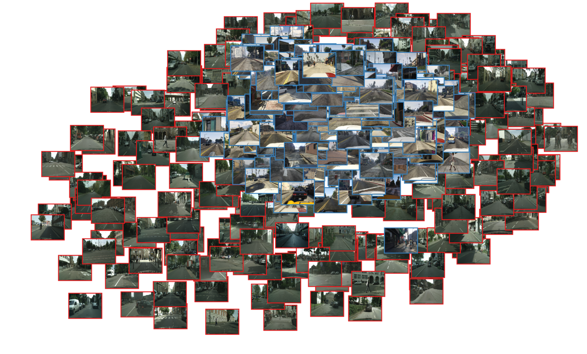
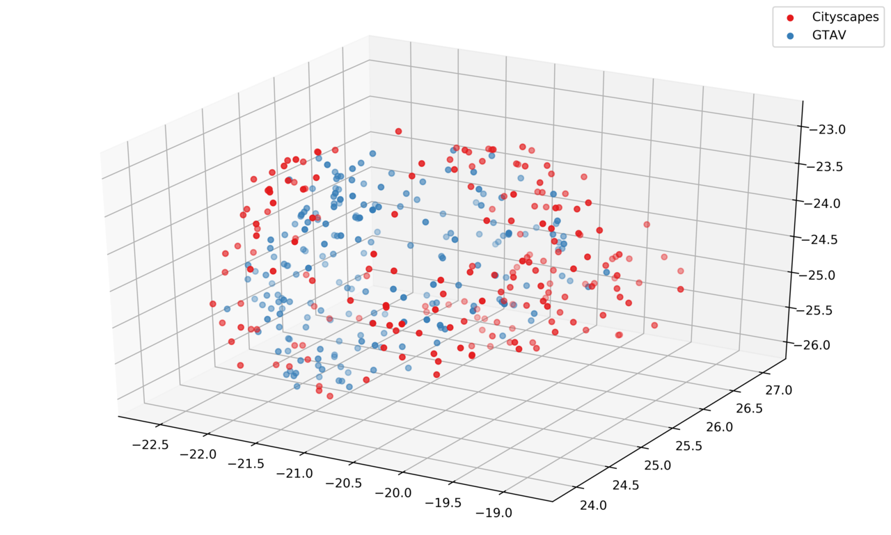

# Distribution Visualization using UMAP.

## What?
UMAPによるデータ分布の可視化を行う．

個人の別レポジトリに似たものがある(Visualization Tool)が，将来的にそっちに統合予定．
(Visualization Toolの方は現状は使いにくいと感じるため)

用意した実行シェルスクリプトは画像の分布を可視化するために作ったが入力はベクトルデータであれば何でも簡単に可視化出来るようにしたつもり．

将来的にnumpy配列から読み込めるようにしておく(DNNの中間特徴等を可視化したいため)

notebook形式の方が使いやすいかもしれない？？？(なるべく依存関係とかを小さくして利用したいためsh実行にしている)

自分で使うための備忘録でもある．

## How to use

`exe.sh`を実行すればOK.編集箇所はシェル変数部分のみで動作するように作成した.

### Modules(in Anaconda3-5.3.1)

- UMAP-learn
- numpy
- PIL
- matplotlib

UMAPのインストール方法(Win, Mac, Linux に対応している)
```sh
conda install -c conda-forge umap-learn
```
もちろん`pip install umap-learn`も可能

### Variables
- GLOB_LIST_STR
  - 読み込み対象の画像群をpythonのglobモジュールを使って読み込む.
  - 文字列からカンマで区切った文だけリストを生成する．
  - 1行の文字列として扱うため，スペース入れずに記述すること(str.split(',')で処理するため)
```
e.g.
GLOB_LIST_STR=\
'/data1/Dataset/cityScapes/leftImg8bit/train/*/*leftImg8bit.png',\
'/data1/Dataset/GTA/Dataset/*/images/*.png'
```

- LABEL_LIST_STR
  - 凡例表示のためのラベル名指定
  - GLOB_LIST_STR で読み込むクラス順に指定する.
```
e.g.
LABEL_LIST_STR='Cityscapes','GTAV'
```

- SAVE_DIR
  - 保存先のディレクトリ名の指定
```
e.g.
SAVE_DIR='city_gtav'
```

- SAMPLE_NUM
  - 各クラスごとに画像を読み込む枚数の指定
```
e.g.
SAMPLE_NUM=200
```

- IS_RANDOM
  - glob で取得したパスリストを順番に読むかランダムに読むかを指定(True or False)
```
e.g.
IS_RANDOM=True
```
- READ_WIDTH
  - 画像のリサイズ幅指定
```
e.g.
READ_WIDTH=320
```
- READ_HEIGHT
  - 画像のリサイズ高さ指定
```
e.g.
READ_HEIGHT=240
```
- UMAP_SEED
  - 次元圧縮処理時のランダムシードの指定
  - -1:実行するたびにランダムなシード値を指定
  - 自然数:シード値を固定化可能
```
e.g.
UMAP_SEED=-1
```


## Example


| 2-Dim Plot                   | 2-Dim Image Plot               | 3-Dim Plot                   |
|:----------------------------:|:------------------------------:|:----------------------------:|
|  |  |  |

